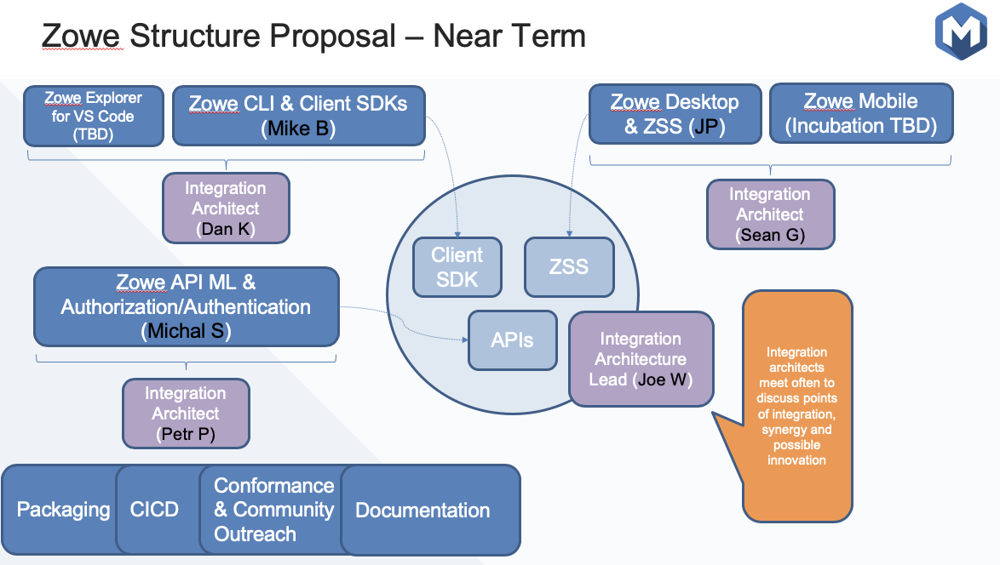

# ZLC Agenda 03-11-20
1. **[https://github.com/zowe/zlc/issues/72](https://github.com/zowe/zlc/issues/72) LTS tweak**

   1. Sujay - saw Joe in agreement 

      1. I would not call this "support policy". It would be better to call it something like "Release Timeline". People are confused about the term "Support" as they're mixing it up with enterprise support where they can call someone and receive support for using Zowe. 

      1. I don't think this line is necessary as it's misleading. The chart shows more than just LTS, it's the full release phases/cadence where LTS is only part of it. 

   1. Request from Mark to show Conformance Program changes on chart??? 

   1. Where I think we are

      1. Conformance update wording complete? 

      1. OMP legal review? 

      1. Do we want to publish LTS and point to existing conformance policy? 

      1. Where are we with new conformance policy agreement? 

   1. Move Conformance Criteria to Github 

      1. Items to be "supported" to be conformant? 

1. [https://github.com/zowe/zlc/issues/161](https://github.com/zowe/zlc/issues/161?email_token=AI6ZRGY2D55BOICXC6QE7N3RGFD6XA5CNFSM4KT3UZUKYY3PNVWWK3TUL52HS4DFVREXG43VMVBW63LNMVXHJKTDN5WW2ZLOORPWSZGOEOCQFVY#issuecomment-595919575) **What do we want to do with squad re-org since we are going inot PI planning**

   1. 

1. **[https://github.com/zowe/zlc/issues/170](https://github.com/zowe/zlc/issues/170)**** - ****Defining "Zowe Core" to be consistent in commercial Zowe Support Offerings**

   1. Now that we have two vendors with commercial support offerings - we need to establish policy/guidelines/rules? 

   1. John - you mentioned you have examples of these? 

1. **Hackathon status?**

1. **March 16 (or whenever) Press Release**

   1. Peter F agreed to help but he and Taylor are out this week - he indicated he was going to provide input to Mae but I've not seen if that happened  

1. **There were Zowe logos created that are symmetrical - did those get donated to the repo?**

1. [https://github.com/zowe/zlc/issues](https://github.com/zowe/zlc/issues)

   1. Review issues - time permitting 

1. **Status of move to LF Jenkins and browser testing ?**

   1. [https://jira.linuxfoundation.org/servicedesk/customer/portal/2/IT-19021](https://urldefense.proofpoint.com/v2/url?u=https-3A__jira.linuxfoundation.org_servicedesk_customer_portal_2_IT-2D19021&d=DwMFaQ&c=jf_iaSHvJObTbx-siA1ZOg&r=QV1pgG1ijEqUgWlri9F2-4fMdhmnGC4fxVGplHz6-M0&m=zAo4zgJlx3vbmqZ1bM2zQDtkk8SQqmm15fb05t1c_sI&s=f019xVZUKkkKBHiqsQlImaBom6E6ujICI5Rf1YLFY9Q&e=): Enable Build with Parameters option for Zowe Jenkins

   1. [https://jira.linuxfoundation.org/servicedesk/customer/portal/2/IT-19022](https://urldefense.proofpoint.com/v2/url?u=https-3A__jira.linuxfoundation.org_servicedesk_customer_portal_2_IT-2D19022&d=DwMFaQ&c=jf_iaSHvJObTbx-siA1ZOg&r=QV1pgG1ijEqUgWlri9F2-4fMdhmnGC4fxVGplHz6-M0&m=zAo4zgJlx3vbmqZ1bM2zQDtkk8SQqmm15fb05t1c_sI&s=WdV08lAQM5rG1uZb6XTzVcpLeF_xJFwJ4B5TWvrYks8&e=): Enabling restrictions on Zowe job access to Zowe committers

   1. [https://jira.linuxfoundation.org/servicedesk/customer/portal/2/IT-19020](https://urldefense.proofpoint.com/v2/url?u=https-3A__jira.linuxfoundation.org_servicedesk_customer_portal_2_IT-2D19020&d=DwMFaQ&c=jf_iaSHvJObTbx-siA1ZOg&r=QV1pgG1ijEqUgWlri9F2-4fMdhmnGC4fxVGplHz6-M0&m=zAo4zgJlx3vbmqZ1bM2zQDtkk8SQqmm15fb05t1c_sI&s=HVUxCZGtbsqLcygCjpPAZfgFJ-u_8oeiK4Zx51Cnu2A&e=): Zowe Cross Browser Test Support

