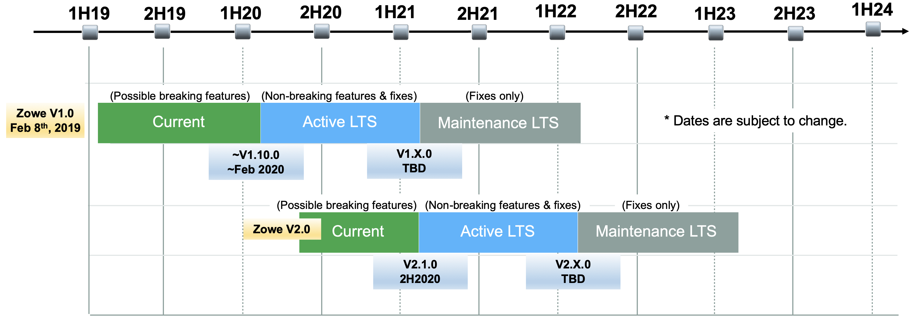

# Zowe Long Term Support (LTS)

This document defines the Zowe Long Term Support schedule for releases.

* Zowe versions enter _Current_ release status for six to nine months to allow consumers of Zowe to test and adjust to any changes.  
* After current phase, Zowe will move to _Active LTS_ status and is deemed ready by the community for general use. 
* _Active LTS_ will have additional releases with both fixes and enhancements.
* _Active LTS_ and _Maintenance LTS_ release status is "long-term support", which typically guarantees that critical1 bugs will be fixed. 
* Exact length of _Active LTS_ may vary but the total time period of _Active LTS_ + _Maintenance LTS_ will be 24 months. 
* Production applications should only use _Active LTS_ or _Maintenance LTS_ releases.

1: Critical = "Security vulnerabilities, performance degradation impacting normal operations, or problem making Zowe inoperable".  See [Additional information](#additional-information).

## Additional information

* There will not be more than one Current, Active LTS or Maintenance release at any given point in time.
* The exact dates of Current to Active LTS and to Maintenance release will vary depending on the judgement of the Zowe community. 
* The open community will be given at least 30 days notice of intent to declare an Active LTS or Maintenance LTS release.  
* A new Current release will be declared when there is a change impacting consumers of Zowe that the community needs a) feedback and/or b) consumers need to test and plan for in advance to the next Active LTS release.
* Characteristics of what is considered a "critical" bug or defect:  
    
    It is difficult to pre-determine all the conditions that will determine when a fix will be created for a Maintenance LTS release. Factors include:   
    * Causes unexpected downtime impacting production environment  
    * No viable workaround  
    * Irrecoverable data corruption 
    * Daily application crash for conformant consumers  
    * Critical security vulnerabilities 
    * Blocks a critical business functionality
    * Fix is technically feasible without risk of additional defects 

